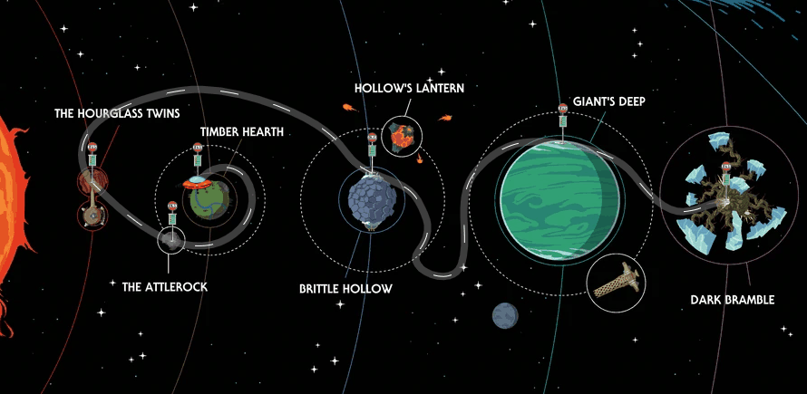

# 路径动画
基于 gsap 动画库封装的 SVG 路径动画绘制工具。更多关于路径动画的使用方法及案例，可以参考 gsap MotionPath。

### 创建实例
```html
<div id="svg-container"></div>
```

```js
import SVGMotionPath from 'SVGMotionPath.js'
// 配置参数
const options = {
  svg: {
    width: 1920,
    height: 1080
  },
  motion: {
    // ease: 'none',
    mobile: {
      ease: 'power1.inOut',
      // durations: []
      // duration: 10,
      speed: 200,
      repeat: -1,
      yoyo: true,
      autoRotate: true,
    },
    trace: {
      duration: 1
    }
  },
  style: {
    line: {
      width: 20,
      color: 'black',
      opacity: 0.4,
      // dash: '2 4'
    },
    trace: {
      width: 2,
      color: 'white',
      // opacity: 1,
      dash: '20 40', // 配合动画使用时，传入偶数个数的参数，例如：'20 40' / '10 20 30 40'
    },
    node: {
      // images: ['xxx.png', 'yyy.png'], // 节点数量大于提供的图片数量时，则正序重复使用数组中的图片
      radius: 4,
      offsetX: 0,
      offsetY: 0,
      fill: 'gold',
      borderWidth: 2,
      borderColor: 'transparent',
    },
    mobile: {
      // image: 'xxx.png',
      size: [20, 20],
      fill: 'gold',
      borderWidth: 2,
      borderColor: 'black',
    }
  }
}
// 实例化
const motionPath = new SVGMotionPath('#svg-container', data, options)
// 事件监听
motionPath.addEventListener('pass', nodePass)
function nodePass(i) {
  ...
}
// 播放动画
motionPath.mobile.play()
```

### 数据源结构（data）
```js
const data = [ // 支持传入坐标或 svg 路径命令，坐标原点为父容器左上角
  { x: 0, y: 0 },
  { x: 100, y: 100 },
  'M100,100 C200,200 400,200 600,100',
]
```

### 配置参数（options）
|           Name           |       Type      |    Default    |                    Description                   |
| ------------------------ | --------------- | ------------- | ------------------------------------------------ |
| svg                      | object          |               | SVG 参数设置。                                    |
| svg.width                | number          | 0             | SVG 视口宽度。                                    |
| svg.height               | number          | 0             | SVG 视口高度。                                    |
| motion                   | object          |               | 路径动画。                                        |
| motion.ease              | string          | none          | 整段运动路径动画的速率。 更多类型可参阅： https://greensock.com/docs/v3/Eases |
| motion.mobile            | object          |               | 路径上移动物体的动画。                             |
| motion.mobile.ease       | string          | none          | 每段运动路径动画的速率。                           |
| motion.mobile.durations  | number[]        | []            | 单独设置每一段路径的运动时长，单位 s。              |
| motion.mobile.duration   | number          |               | 运动所需的总时长，单位 s。优先级低于 durations。    |
| motion.mobile.speed      | number          | 100           | 运动速度，表示每秒经过的像素点。优先级低于 duration 和 durations。 |
| motion.mobile.autoRotate | boolean         | false         | 运动方向是否跟随路径方向同步旋转。                  |
| motion.mobile.repeat     | number          | 0             | 重复运动。                                        |
| motion.mobile.yoyo       | boolean         | false         | 往复运动。                                        |
| motion.flow              | object          |               | 路径流的动画，默认无限重复运动。                    |
| motion.flow.duration     | number          | 0             | 调节路径流动画的快慢，单位 s。                      |
| style                    | object          |               | 路径样式。                                        |
| style.line               | object          |               | 线条样式。                                        |
| style.line.width         | number          | 1             | 线条宽度。                                        |
| style.line.color         | string          | black         | 线条颜色。                                        |
| style.line.opacity       | number          | 1             | 线条透明度。                                      |
| style.line.dash          | string          | 0             | 线条虚线，可参考 stroke-dasharray(SVG) 属性。      |
| style.flow               | object          |               | 路径流样式（可理解为叠加在 line 上的另一条线），不传此参数时默认隐藏。 |
| style.flow.width         | number          | 1             | 路径流宽度。                                        |
| style.flow.color         | string          | white         | 路径流颜色。                                        |
| style.flow.opacity       | number          | 1             | 路径流透明度。                                      |
| style.flow.dash          | string          | 20 40         | 路径流长度，如果需要配合动画使用，此参数必须为偶数，否则动画无法衔接。 |
| style.node               | object          |               | 节点样式，整段路径的起点与终点和每段路径的连接处视为节点。 |
| style.node.images        | string[]        | []            | 当数组不为空时，节点以数组中的图片资源重复循环渲染，默认节点隐藏。 |
| style.node.offsetX       | number          | 5             | 节点在水平方向上的偏移量。                          |
| style.node.offsetY       | number          | 5             | 节点在垂直方向上的偏移量。                          |
| style.node.radius        | number          | 5             | 节点的半径大小。                                   |
| style.node.fill          | string          | white         | 节点的填充颜色。                                   |
| style.node.borderColor   | string          | black         | 节点的外轮廓颜色。                                 |
| style.node.borderWidth   | number          | 1             | 节点的外轮廓宽度。                                 |
| style.mobile             | object          |               | 路径上的移动物体样式，移动物体默认方向为从左向右。    |
| style.mobile.image       | string          |               | 图片替代移动物体，传入此参数后默认移动物体隐藏。      |
| style.mobile.size        | array           | [16, 16]      | 移动物体的大小。                                   |
| style.mobile.fill        | string          | white         | 移动物体的填充颜色。                                |
| style.mobile.borderColor | number          | 1             | 移动物体的外轮廓颜色。                              |
| style.mobile.borderWidth | number          | 1             | 移动物体的外轮廓宽度。                              |

### 属性（attributes）
|           Name           |       Type      |                    Description                                    |
| ------------------------ | --------------- | ----------------------------------------------------------------- |
| mobile                   | object          | 路径上运动物体的动画实例，动画的播放、暂停等方法暴露在此对象上。        |
| flow                     | object          | 路径流的动画实例，动画的播放、暂停等方法暴露在此对象上。               |
| nodes                    | HTMLElement[]   | 路径上所有的节点元素。                                              |

### 方法（methods）
|           Name           |       Parameters      |                       Description                           |
| ------------------------ | --------------------- | ----------------------------------------------------------- |
| addEventListener()       | event,function        | 注册事件监听器。                                              |
| removeEventListener()    | event,function        | 注销事件监听器。                                              |
| kill()                   |                       | 实例销毁。                                                   |
| seek()                   | position              | 动画跳转到指定位置（参数为节点下标），不影响动画的播放或暂停，仅在不设置 ease 时有效。|
| mobile.play()            | from,suppressEvents   | 动画播放。                                                   |
| mobile.pause()           | atTime,suppressEvents | 动画暂停。                                                   |
| mobile.resume()          |                       | 动画继续播放。                                               |
| mobile.restart()         | includeDelay,suppressEvents | 动画重新播放。                                         |
| mobile.reverse()         | from,suppressEvents   | 动画反转。                                                   |
| mobile.seek()            | time,suppressEvents   | 动画跳转到指定位置（参数为动画时间），不影响动画的播放或暂停。   |

关于更多动画的属性或方法及入参说明，可参阅 https://greensock.com/docs/v3/GSAP/Tween

### 事件（events）
|           Name           |       Parameters      |                       Description                           |
| ------------------------ | --------------------- | ----------------------------------------------------------- |
| start                    |                       | 移动物体动画开始播放时触发。                                   |
| end                      |                       | 移动物体动画结束播放时触发。                                   |
| pass                     | index                 | 移动物体每经过一个节点时触发，返回参数为当前经过的节点位置。      |
| repeat                   |                       | 移动物体动画重复播放时触发。                                   |

在 Path 实例上通过 addEventListener 方法监听某个事件类型，也可通过 removeEventListener 对事件监听进行移除。

### 效果图

